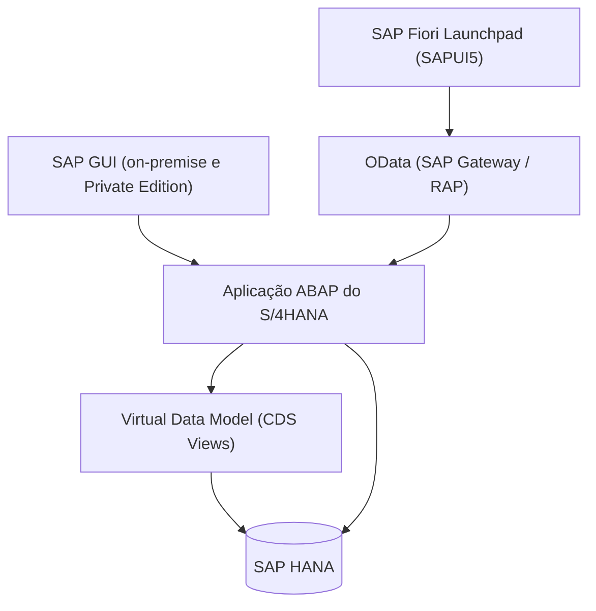
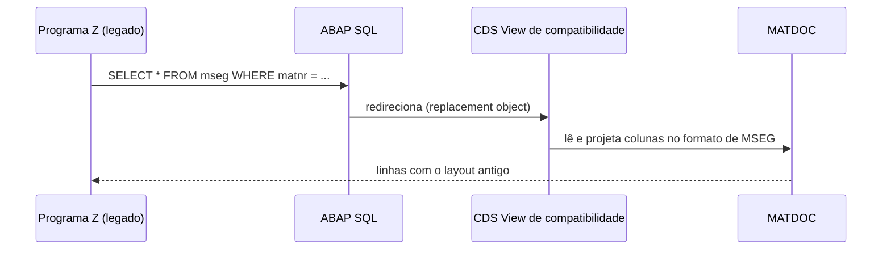
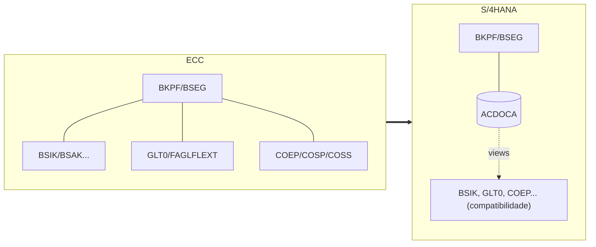
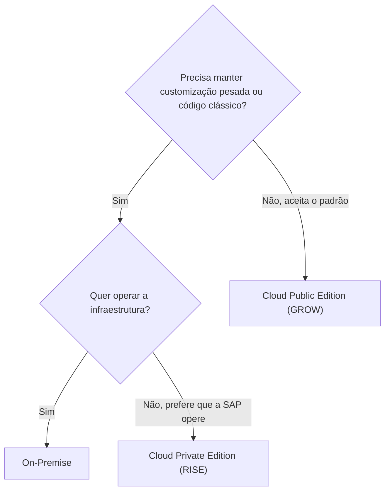

# SAP S/4HANA - Study

> Nível: prática
> O ERP atual da SAP e o ponto de partida da fase 0 do roadmap. Este README também é o **índice da fase 0** (ver seção [Índice da fase 0](#índice-da-fase-0)). Relacionados: [SAP ECC](../SAP-ECC-erp-study/), [On-Premise](../SAP-S4HANA-On-Premise-erp-study/), [Cloud Private Edition](../SAP-S4HANA-Cloud-Private-Edition-erp-study/), [Cloud Public Edition](../SAP-S4HANA-Cloud-Public-Edition-erp-study/).

## Objetivo

Entender o que define o SAP S/4HANA, o que ele simplificou em relação ao ECC e o que essas simplificações significam para quem escreve ABAP. Quase toda vaga SAP de hoje cita S/4HANA, seja em implantação nova, seja em conversão de ECC. Saber explicar por que um `SELECT` antigo continua funcionando, e por que um `UPDATE` antigo não pode mais ser feito, é o tipo de pergunta que separa quem só leu o nome do produto de quem entendeu o modelo.

Ao concluir este estudo você deverá ser capaz de responder perguntas como:

- O que define o S/4HANA em relação ao ECC?
- O que é a *simplification list* e por que ela importa para o desenvolvedor?
- O que muda do ECC para o S/4HANA para quem desenvolve?
- Por que um `SELECT` em `MSEG` ainda funciona no S/4HANA?
- O que é o Universal Journal (`ACDOCA`) e o que ele substituiu?
- Quais são as três edições do S/4HANA e como escolher entre elas?

---

## Ponte

| No que eu já conheço | No S/4HANA |
|---|---|
| Reescrever um ERP legado trocando o banco para um que aguenta agregação em tempo real | S/4HANA: nova geração do ERP escrita para rodar só sobre o SAP HANA |
| Remover tabelas de resumo e usar `VIEW` ou `GROUP BY` direto na tabela de movimentos | Agregados do ECC removidos e substituídos por views de compatibilidade |
| Criar uma `VIEW` com o nome da tabela antiga para não quebrar relatórios legados | *Proxy objects* / *replacement objects*: o nome antigo (`MSEG`, `BSIK`) passa a ler uma CDS View |
| Changelog de *breaking changes* de uma versão maior de framework (ex.: Laravel 10 para 11) | *Simplification list*: lista oficial de mudanças funcionais e técnicas por release |
| Unificar `clientes` e `fornecedores` numa tabela `pessoas` com papéis | Business Partner obrigatório |
| Front-end SPA consumindo API em vez de telas renderizadas no servidor | Fiori (SAPUI5 + OData) como interface principal |
| Diferença entre instalar o sistema, hospedar num VPS gerenciado ou assinar um SaaS | On-Premise, Cloud Private Edition e Cloud Public Edition |

---

## Conteúdo

### 1. O que define o S/4HANA

S/4HANA significa *SAP Business Suite 4 SAP HANA*. Lançado em 2015 (release 1511), ele não é um upgrade do ECC, e sim um novo produto com três características que o definem:

1. **Roda somente sobre o SAP HANA.** Não há opção de Oracle, Db2 ou SQL Server. Isso permitiu remover redundâncias que só existiam para compensar bancos lentos em agregação.
2. **Modelo de dados simplificado**, documentado na *simplification list*.
3. **Fiori como interface principal**, com SAP GUI ainda disponível nas edições on-premise e Private Edition.

Somam-se a isso o **Virtual Data Model** (VDM), formado por CDS Views publicadas pela SAP, a análise embutida (*embedded analytics*) e, mais recentemente, ABAP Cloud e Clean Core como modelo oficial de extensão.

### 2. Simplification list

A *simplification list* é o documento oficial, publicado por release, com cada **simplification item**: funcionalidades removidas, substituídas ou alteradas em relação ao ECC. Cada item traz o impacto em negócio e em código custom, geralmente com notas SAP associadas.

Para o desenvolvedor, ela alimenta:

- O **SAP Readiness Check**, que analisa um ECC e lista os itens relevantes para aquele cliente.
- As **verificações de código custom para S/4HANA** no ABAP Test Cockpit (ATC), que apontam código que lê ou grava objetos simplificados.

Esses passos são o assunto de [SAP-S4HANA-Migration-erp-study](../SAP-S4HANA-Migration-erp-study/).

### 3. Simplificações que afetam quem desenvolve

| Área | ECC | S/4HANA | Impacto no código custom |
|---|---|---|---|
| Contabilidade | `BKPF`/`BSEG`, índices `BSIK`/`BSAK`/`BSID`/`BSAD`/`BSIS`/`BSAS`, totais `GLT0`/`FAGLFLEXT`, CO em `COEP` | **Universal Journal** `ACDOCA` para FI e CO; índices e totais viram views de compatibilidade | Leitura continua funcionando; gravação direta nessas tabelas deixa de ser possível |
| Estoque | `MKPF` + `MSEG`, quantidades gravadas em `MARD`, `MARC` etc. | **`MATDOC`** como tabela única de documento de material; estoques calculados a partir dela | Idem: `SELECT` funciona via view; `INSERT`/`UPDATE` direto não |
| Dados mestres de parceiros | `KNA1`/`LFA1` mantidos por XD01/XK01 | **Business Partner** obrigatório, sincronizado por CVI com `KNA1`/`LFA1` | Programas de carga precisam usar APIs de BP |
| Material | `MATNR` com 18 caracteres | `MATNR` pode ter até 40 caracteres | Variáveis, estruturas e interfaces com tamanho fixo precisam de revisão |
| Vendas: status | `VBUK`/`VBUP` | Campos de status incorporados em `VBAK`/`VBAP`, `LIKP`/`LIPS` etc. | Leituras de `VBUK`/`VBUP` precisam ser adaptadas (confirme o item na *simplification list*) |
| Vendas: condições | `KONV` | `PRCD_ELEMENTS` | Leituras diretas de `KONV` precisam ser revistas |
| Armazém | WM clássico (LE-WM) | EWM (embutido ou descentralizado) | Ver [WM](../SAP-WM-erp-study/) e [EWM](../SAP-EWM-erp-study/) |
| Interface | SAP GUI | Fiori | Novas telas passam a ser apps Fiori / RAP |

### 4. Por que um `SELECT` em `MSEG` ainda funciona

No S/4HANA, `MSEG` continua existindo no dicionário, mas tem um **objeto substituto** (*replacement object* ou *proxy object*): uma CDS View que monta o resultado a partir de `MATDOC`. Quando o código executa `SELECT ... FROM mseg`, o ABAP SQL redireciona a leitura para essa view. O programa legado compila e roda sem mudança.

O mesmo vale para `MKPF`, para as tabelas de agregados de estoque e para `BSIK`, `BSAK`, `GLT0` e similares sobre `ACDOCA`. As consequências:

- **Leitura: funciona**, mas pode ser mais lenta do que ler `MATDOC` ou as CDS Views do VDM diretamente, porque a view reconstrói o formato antigo.
- **Gravação: não funciona.** Código que fazia `INSERT` ou `UPDATE` direto nessas tabelas (prática já desaconselhada no ECC) quebra. O caminho é usar BAPIs ou APIs liberadas.
- Para descobrir se uma tabela tem objeto substituto, abra-a na SE11 ou no ADT e verifique a configuração de *replacement object* (confirme o caminho de menu na sua versão).

### 5. Universal Journal (`ACDOCA`)

No ECC, uma fatura de fornecedor gravava cabeçalho, itens, índice de aberto, totais do razão, e ainda itens e totais de controladoria em tabelas próprias. No S/4HANA, contabilidade financeira (FI), controladoria (CO), ativo imobilizado e parte do *material ledger* gravam uma **linha por item** numa única tabela, `ACDOCA`, com todas as dimensões (conta, centro de custo, centro de lucro, segmento...).

`BKPF` continua sendo o cabeçalho e `BSEG` continua existindo como visão de entrada do documento. O ganho é a eliminação da reconciliação entre FI e CO, que no ECC eram gravados separadamente. Mais em [SAP-FI-erp-study](../SAP-FI-erp-study/) e [SAP-CO-erp-study](../SAP-CO-erp-study/).

### 6. O que muda para quem desenvolve

| Tema | ECC | S/4HANA |
|---|---|---|
| Acesso a dados | `SELECT` em tabelas, muitas vezes com `FOR ALL ENTRIES` e loops | CDS Views, VDM (`I_...`, `C_...`), lógica empurrada para o banco (*code pushdown*) |
| Interface | Dynpro, ALV, SAP GUI | Fiori Elements, SAPUI5, RAP |
| Exposição de serviços | RFC, BAPI, IDoc, SEGW (OData V2) | RAP com OData V4 e V2, APIs publicadas no SAP Business Accelerator Hub |
| Extensão | *User exits*, BAdIs, modificações | ABAP Cloud, APIs liberadas, *key user extensibility*, extensões no BTP |
| Qualidade | Code Inspector, ATC opcional | ATC com verificações de S/4HANA e de Clean Core |
| Ferramenta | SE80 no SAP GUI | ADT no Eclipse (SE80 continua nas edições que permitem) |

Os temas dessa tabela são as fases 3 a 6 do roadmap. O ABAP clássico continua necessário para sustentação e para conversões (fase 7).

### 7. As três edições

| | On-Premise | Cloud Private Edition | Cloud Public Edition |
|---|---|---|---|
| Quem opera | Cliente ou parceiro de hosting | SAP (em hyperscaler ou data center da SAP) | SAP |
| Modelo | Licença | Assinatura | Assinatura (SaaS) |
| Código-base | S/4HANA | O mesmo do on-premise | Produto SaaS próprio, multi-tenant |
| Modificação do padrão | Permitida | Permitida, mas desencorajada (Clean Core) | Não permitida |
| ABAP clássico | Sim | Sim | Não; só ABAP Cloud |
| Ritmo de upgrade | O cliente decide | Acordado no contrato, dentro das releases suportadas | Definido pela SAP, em ciclos fixos |
| Pacote comercial típico | Venda tradicional | [RISE with SAP](../RISE-with-SAP-erp-study/) | [GROW with SAP](../GROW-with-SAP-erp-study/) |
| Caminho a partir do ECC | Conversão, nova implantação ou transição seletiva | Conversão, nova implantação ou transição seletiva | Nova implantação (*greenfield*) |
| Estudo | [On-Premise](../SAP-S4HANA-On-Premise-erp-study/) | [Private Edition](../SAP-S4HANA-Cloud-Private-Edition-erp-study/) | [Public Edition](../SAP-S4HANA-Cloud-Public-Edition-erp-study/) |

O fluxograma é uma simplificação: na prática entram também custo, país, requisitos fiscais e cobertura funcional de cada edição.

---

## Índice da fase 0

Fase 0 do roadmap: **Negócio e ecossistema SAP**. Repositórios de documentação, sem código ABAP.

### Produto e edições

| Repositório | Nível | Tema |
|---|---|---|
| [SAP-ECC-erp-study](../SAP-ECC-erp-study/) | prática | O ERP anterior, fim da manutenção e modelo de dados antigo |
| [SAP-S4HANA-erp-study](../SAP-S4HANA-erp-study/) | prática | Este repositório: o que define o S/4HANA e índice da fase |
| [SAP-S4HANA-On-Premise-erp-study](../SAP-S4HANA-On-Premise-erp-study/) | prática | Edição instalada e operada pelo cliente |
| [SAP-S4HANA-Cloud-Private-Edition-erp-study](../SAP-S4HANA-Cloud-Private-Edition-erp-study/) | prática | Mesmo produto, operado pela SAP |
| [SAP-S4HANA-Cloud-Public-Edition-erp-study](../SAP-S4HANA-Cloud-Public-Edition-erp-study/) | prática | SaaS multi-tenant, só ABAP Cloud |
| [RISE-with-SAP-erp-study](../RISE-with-SAP-erp-study/) | noção | Pacote comercial da Private Edition |
| [GROW-with-SAP-erp-study](../GROW-with-SAP-erp-study/) | noção | Pacote comercial da Public Edition |

### Estrutura, dados mestres e papéis

| Repositório | Nível | Tema |
|---|---|---|
| [SAP-Enterprise-Structure-erp-study](../SAP-Enterprise-Structure-erp-study/) | prática | Mandante, empresa, centro, depósito, organizações |
| [SAP-Business-Partner-erp-study](../SAP-Business-Partner-erp-study/) | prática | Business Partner e CVI |
| [SAP-RICEFW-erp-study](../SAP-RICEFW-erp-study/) | prática | Papéis no mercado e tipos de objeto de desenvolvimento |

### Módulos e processos

| Repositório | Nível | Tema |
|---|---|---|
| [SAP-MM-erp-study](../SAP-MM-erp-study/) | prática | Materiais, compras, estoque |
| [SAP-SD-erp-study](../SAP-SD-erp-study/) | prática | Vendas, remessa, faturamento |
| [SAP-FI-erp-study](../SAP-FI-erp-study/) | prática | Contabilidade financeira |
| [SAP-CO-erp-study](../SAP-CO-erp-study/) | noção | Controladoria |
| [SAP-WM-erp-study](../SAP-WM-erp-study/) | noção | Warehouse Management clássico |
| [SAP-EWM-erp-study](../SAP-EWM-erp-study/) | noção | Extended Warehouse Management |
| [SAP-Procure-to-Pay-erp-study](../SAP-Procure-to-Pay-erp-study/) | prática | Fluxo de compras ponta a ponta |
| [SAP-Order-to-Cash-erp-study](../SAP-Order-to-Cash-erp-study/) | prática | Fluxo de vendas ponta a ponta |

Ordem sugerida: produto e edições (semana 1), estrutura e dados mestres (semana 2), módulos e processos (semanas 3 e 4).

---

## Respostas

**O que define o S/4HANA em relação ao ECC?**
Roda somente sobre o SAP HANA, tem um modelo de dados simplificado (documentado na *simplification list*) e usa Fiori como interface principal. Não é um upgrade do ECC, e sim um produto novo, para o qual se converte ou se reimplanta.

**O que é a simplification list e por que importa para o desenvolvedor?**
É a lista oficial, por release, das funcionalidades e estruturas que mudaram em relação ao ECC. Ela alimenta o Readiness Check e as verificações de ATC que apontam o código custom que precisa ser adaptado numa conversão.

**O que muda do ECC para o S/4HANA para quem desenvolve?**
As tabelas centrais (`ACDOCA`, `MATDOC`, Business Partner, `MATNR` com 40 caracteres), o acesso a dados (CDS Views e VDM em vez de `SELECT` em tabelas), a interface (Fiori e RAP em vez de dynpro), a exposição de serviços (OData e APIs publicadas) e o modelo de extensão (ABAP Cloud e Clean Core em vez de modificações).

**Por que um SELECT em MSEG ainda funciona no S/4HANA?**
Porque `MSEG` tem um objeto substituto: uma CDS View de compatibilidade que monta os dados a partir de `MATDOC`. O ABAP SQL redireciona a leitura para ela. Gravação direta, porém, não é possível, e a leitura pela view de compatibilidade pode ser menos eficiente do que ler o modelo novo.

**O que é o Universal Journal e o que ele substituiu?**
É a tabela `ACDOCA`, onde FI, CO, ativo imobilizado e parte do *material ledger* gravam uma linha por item com todas as dimensões. Substituiu tabelas de totais e de índice (`GLT0`, `FAGLFLEXT`, `BSIK`/`BSAK`...) e as tabelas de itens de CO, que viraram views de compatibilidade.

**Quais são as três edições e como escolher?**
On-Premise (o cliente opera, liberdade total), Cloud Private Edition (mesmo produto, operado pela SAP, normalmente via RISE) e Cloud Public Edition (SaaS, só padrão e ABAP Cloud, normalmente via GROW). A escolha depende do grau de customização necessário, de quem opera a infraestrutura e de quanto o cliente aceita o processo padrão.

---

## Referências

- SAP Help Portal: https://help.sap.com (buscar "SAP S/4HANA", "Simplification List for SAP S/4HANA")
- SAP Learning: https://learning.sap.com (trilhas gratuitas de introdução ao SAP S/4HANA)
- SAP Community: https://community.sap.com (buscar "MATDOC compatibility view", "Universal Journal ACDOCA")
- SAP Business Accelerator Hub: https://api.sap.com (APIs e CDS Views publicadas do S/4HANA)
